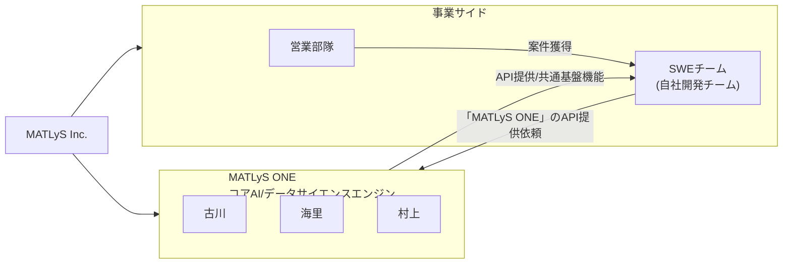

# MATLyS Inc. 組織図

MATLyS Inc.の組織構造とコアエンジン、事業サイドの関係を示す図です。

## 概要

- **MATLyS ONE**: コアAI/データサイエンスエンジン（古川、海里、村上で構成）
- **事業サイド**: 営業部隊とSWEチーム（自社開発チーム）
- **関係性**: 営業部隊が案件を獲得 → SWEチームが実装 → COREからAPI提供を受ける
