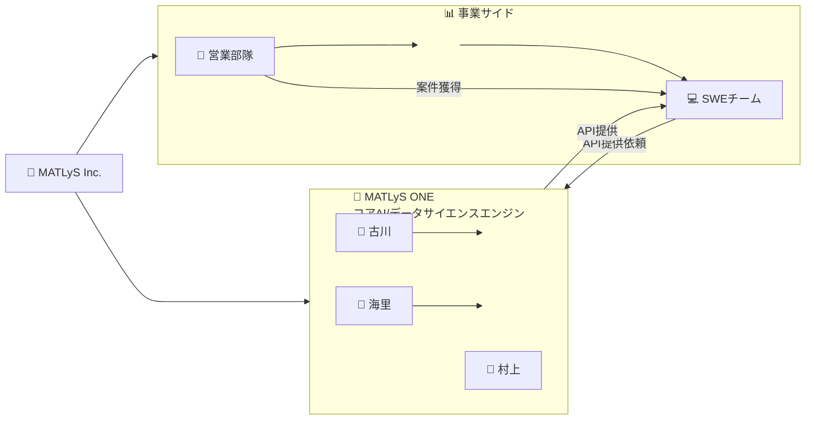

# MATLyS Inc. 組織図

MATLyS Inc.の組織構造とコアエンジン、事業サイドの関係を示す図です。

## 組織構成

### MATLyS ONE（コアエンジン）
- 古川、海里、村上で構成
- AI/データサイエンスの基盤技術を提供

### 事業サイド
- **営業部隊**: クライアント案件の獲得
- **SWEチーム**: 自社開発、クライアント対応

## ワークフロー

1. **営業部隊** → 案件を獲得
2. **SWEチーム** → 案件の実装を開始、コアエンジンにAPI提供を依頼
3. **MATLyS ONE** → API・共通基盤機能を提供
4. **SWEチーム** → クライアントへのサービス実装を完了
